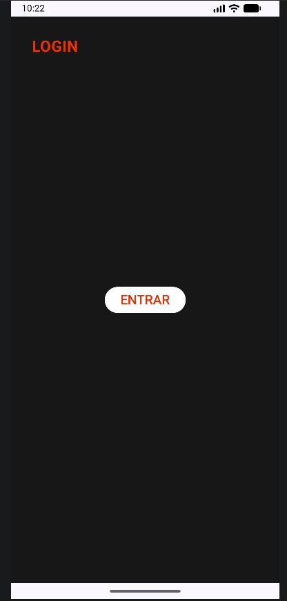
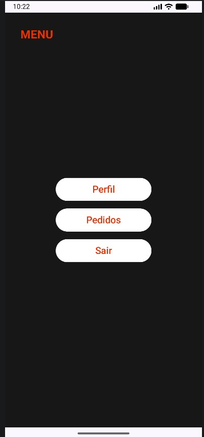
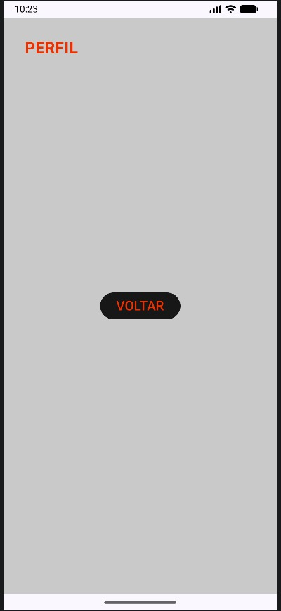
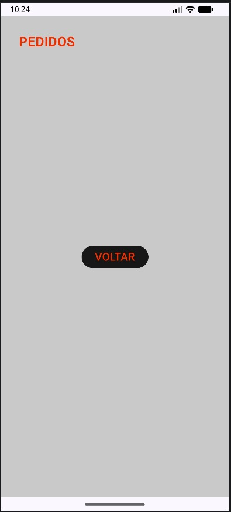

# Navigation Screens App

Projeto sobre navegação entre telas proposto pelo professor Ewerton Luiz utilizando o Navigation Compose no Kotlin. 

Nome: Matheus Richard Hadermeck
Turma: 3SIR

## Screenshots

### Tela de Login

### Tela de Menu

### Tela de Perfil

### Tela de Pedidos

